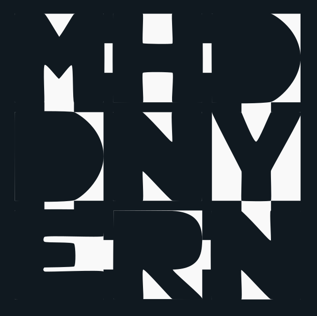
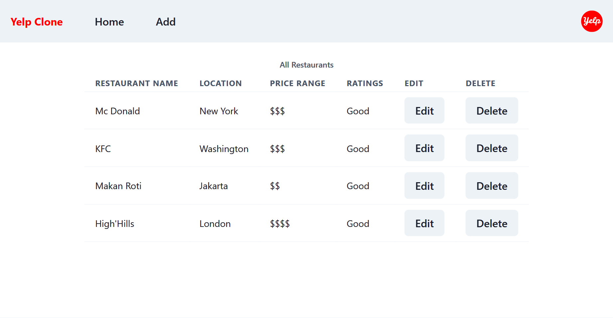

<a name="readme-top"></a>

<!-- MY PROJECT -->
<br />
<div align="center">
  
  <h3 align="center">Mucodevde</h3>
</div>

<!-- TABLE OF CONTENTS -->
<details>
  <summary>Table of Contents</summary>
  <ol>
    <li><a href="#about-the-project">About The Project</a><li>
    <li><a href="#built-with">Built With</a></li>
  </ol>
</details>

<!-- ABOUT THE PROJECT -->
## About The Project



Create simple yelp clone

<p align="right">(<a href="#readme-top">back to top</a>)</p>

### Built With

This section should list any major frameworks/libraries used to bootstrap the project.

* [ReactJS - Vite](https://vitejs.dev/)
* [Chakra UI](https://chakra-ui.com/)

<p align="right">(<a href="#readme-top">back to top</a>)</p>

<!-- GETTING STARTED -->
## Getting Started
This is an example of how you may give instructions on setting up your project locally.
To get a local copy up and running follow these simple example steps.

### Prerequisites
This is an example of how to list things you need to use the software and how to install them.
* npm
  ```sh
  npm install npm@latest -g
  ```

### Installation

_Below is an example of how you can instruct your audience on installing and setting up your app. This template doesn't rely on any external dependencies or services._

1. Get a free API Key at [https://example.com](https://example.com)
2. Clone the repo
   ```sh
   git clone https://github.com/your_username_/Project-Name.git
   ```
3. Install NPM packages
   ```sh
   npm install
   ```
4. Go to server folder and run server
   ```sh
   cd server && npm run server
   ```
5. Go to client folder and run
   ```sh
   cd ../client && npm start
   ```

<p align="right">(<a href="#readme-top">back to top</a>)</p>